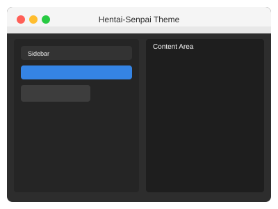
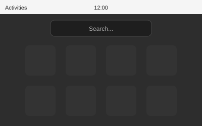

# Hentai-Senpai Theme

A beautiful dark GTK theme based on [Orchis](https://github.com/vinceliuice/Orchis-theme) with the [Nord](https://www.nordtheme.com/) color palette.


## Features

- **Dark & Elegant** — Deep blue-gray backgrounds with comfortable contrast
- **Nord Colors** — Beautiful Arctic-inspired color scheme
- **Material Design** — Rounded corners, smooth shadows, ripple effects
- **Multi-DE Support** — Works with GNOME, Cinnamon, XFCE, Budgie, and MATE
- **Complete Theming** — GTK2/3/4, GNOME Shell, window decorations, and wallpapers

## Quick Install

```bash
# Install the theme
./install.sh

# Apply the theme
./apply-theme.sh
```

## Requirements

- GTK 3.20+ or GTK 4.0+
- GNOME Shell 40+ (for GNOME users)
- Bash 4.0+

## Installation Options

| Option | Description |
|--------|-------------|
| `--update` | Update/reinstall the theme |
| `-u, --uninstall` | Remove the theme |
| `-l, --libadwaita` | Fix GTK4/libadwaita apps |
| `-f, --flatpak` | Fix Flatpak sandboxed apps |
| `--dock [TYPE]` | Style your dock (transparent or solid) |
| `--check-deps` | Check and install dependencies |
| `--system-info` | Show system info and compatibility |

## Examples

```bash
# Fresh install with all fixes
./install.sh --update -l -f --dock

# Just fix the dock
./install.sh --dock transparent

# Check and install missing dependencies
./install.sh --check-deps

# Show system information
./install.sh --system-info

# Remove everything
./install.sh --uninstall
```

## Documentation

📖 **[Full Documentation](docs/)**

- [Installation Guide](docs/INSTALLATION.md) — Detailed installation instructions
- [Troubleshooting](docs/TROUBLESHOOTING.md) — Common issues and fixes
- [Color Palette](docs/COLOR_PALETTE.md) — Theme colors reference
- [Customization](docs/CUSTOMIZATION.md) — Personalize the theme

## Screenshots

| GTK Applications | GNOME Shell | Window Controls |
|----------------|-------------|-----------------|
|  |  |  |

## Credits

- Based on [Orchis Theme](https://github.com/vinceliuice/Orchis-theme) by vinceliuice
- [Nord Theme](https://www.nordtheme.com/) color palette by Arctic Ice Studio
- Material Design by Google

## License

GPL-3.0 License
