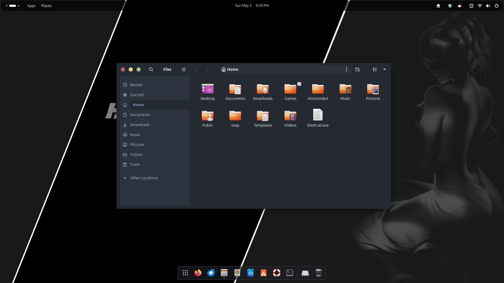
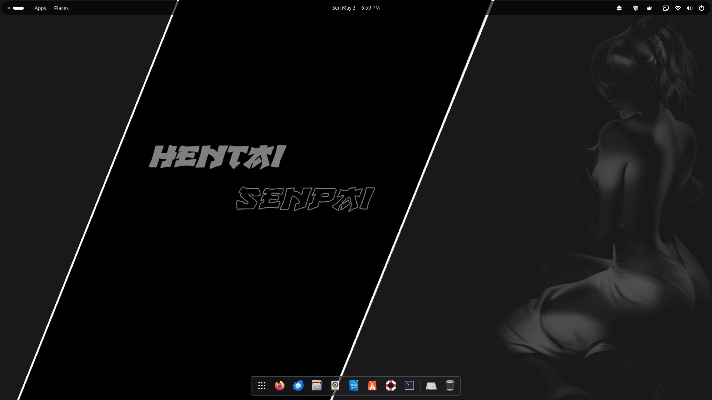

<div align="right" style="margin-bottom: 10px;">
  <details>
    <summary style="background: #2E3440; color: #D8DEE9; border: 1px solid #4C566A; border-radius: 6px; padding: 6px 12px; cursor: pointer; font-size: 13px; display: inline-flex; align-items: center; gap: 6px; font-family: -apple-system, BlinkMacSystemFont, 'Segoe UI', Helvetica, Arial, sans-serif; list-style: none;">🌐 Sprache</summary>
    <div style="margin-top: 8px; padding: 10px; background: #3B4252; border: 1px solid #4C566A; border-radius: 6px; text-align: right;">
      <div style="margin-bottom: 4px;"><a href="../../README.md" style="color: #88C0D0; text-decoration: none;">🇺🇸 English</a></div>
      <div style="margin-bottom: 4px;"><a href="../pt-br/README.md" style="color: #88C0D0; text-decoration: none;">🇧🇷 Português</a></div>
      <div style="margin-bottom: 4px;"><a href="../es-es/README.md" style="color: #88C0D0; text-decoration: none;">🇪🇸 Español</a></div>
      <div style="margin-bottom: 4px;"><a href="../fr-fr/README.md" style="color: #88C0D0; text-decoration: none;">🇫🇷 Français</a></div>
      <div style="margin-bottom: 4px;"><a href="../de-de/README.md" style="color: #88C0D0; text-decoration: none;"><strong>🇩🇪 Deutsch</strong></a></div>
      <div style="margin-bottom: 4px;"><a href="../it-it/README.md" style="color: #88C0D0; text-decoration: none;">🇮🇹 Italiano</a></div>
      <div style="margin-bottom: 4px;"><a href="../ja-jp/README.md" style="color: #88C0D0; text-decoration: none;">🇯🇵 日本語</a></div>
      <div style="margin-bottom: 4px;"><a href="../zh-cn/README.md" style="color: #88C0D0; text-decoration: none;">🇨🇳 中文</a></div>
      <div><a href="../ru-ru/README.md" style="color: #88C0D0; text-decoration: none;">🇷🇺 Русский</a></div>
    </div>
  </details>
</div>


<div align="center">
<pre>
╔══════════════════════════════════════════════════════════════════╗
║                                                                  ║
║          ██╗  ██╗███████╗███╗   ██╗████████╗ █████╗ ██╗          ║
║          ██║  ██║██╔════╝████╗  ██║╚══██╔══╝██╔══██╗██║          ║
║          ███████║█████╗  ██╔██╗ ██║   ██║   ███████║██║          ║
║          ██╔══██║██╔══╝  ██║╚██╗██║   ██║   ██╔══██║██║          ║
║          ██║  ██║███████╗██║ ╚████║   ██║   ██║  ██║██║          ║
║          ╚═╝  ╚═╝╚══════╝╚═╝  ╚═══╝   ╚═╝   ╚═╝  ╚═╝╚═╝          ║
║                                                                  ║
║          ███████╗███████╗███╗   ██╗██████╗  █████╗ ██╗           ║
║          ██╔════╝██╔════╝████╗  ██║██╔══██╗██╔══██╗██║           ║
║          ███████╗█████╗  ██╔██╗ ██║██████╔╝███████║██║           ║
║          ╚════██║██╔══╝  ██║╚██╗██║██╔═══╝ ██╔══██║██║           ║
║          ███████║███████╗██║ ╚████║██║     ██║  ██║██║           ║
║          ╚══════╝╚══════╝╚═╝  ╚═══╝╚═╝     ╚═╝  ╚═╝╚═╝           ║
║                                                                  ║
║            GTK Theme • Nord Colors • Dark & Elegant              ║
║                                                                  ║
╚══════════════════════════════════════════════════════════════════╝
</pre>
</div>

<p align="center">
  <a href="https://github.com/PhantomNimbi/Hentai-Senpai-GTK-Theme/releases"></a>
  <a href="https://github.com/PhantomNimbi/Hentai-Senpai-GTK-Theme/blob/main/LICENSE"></a>
  <a href="https://github.com/PhantomNimbi/Hentai-Senpai-GTK-Theme/stargazers"></a>
  <a href="https://github.com/PhantomNimbi/Hentai-Senpai-GTK-Theme/issues"></a>
  <a href="https://gtk.org"></a>
</p>

<p align="center">Ein schönes dunkles GTK-Theme basierend auf <a href="https://github.com/vinceliuice/Orchis-theme">Orchis</a> mit der eleganten <a href="https://www.nordtheme.com/">Nord</a> Farbpalette.</p>

## 📸 Galerie

<table>
  <tr>
    <td width="50%">
      
      <p align="center"><strong>Anwendungen</strong> - GTK-Anwendungen mit dem Theme</p>
    </td>
    <td width="50%">
      
      <p align="center"><strong>Desktop</strong> - Vollständige Desktop-Erfahrung</p>
    </td>
  </tr>
</table>

<h2 align="center">🐧 Unterstützte Distributionen</h2>

<p align="center">
  <a href="https://ubuntu.com"></a>&nbsp;&nbsp;
  <a href="https://www.debian.org"></a>&nbsp;&nbsp;
  <a href="https://getfedora.org"></a>&nbsp;&nbsp;
  <a href="https://archlinux.org"></a>&nbsp;&nbsp;
  <a href="https://manjaro.org"></a>&nbsp;&nbsp;
  <a href="https://www.opensuse.org"></a>&nbsp;&nbsp;
  <a href="https://linuxmint.com"></a>&nbsp;&nbsp;
  <a href="https://pop.system76.com"></a>
</p>

## Funktionen

- **Dunkel und Elegant** — Tief blaugraue Hintergründe mit angenehmem Kontrast
- **Nord-Farben** — Arktisch inspiriertes Farbschema für Klarheit
- **Material Design** — Abgerundete Ecken, sanfte Schatten, Ripple-Effekte
- **Multi-DE-Unterstützung** — GNOME, Cinnamon, XFCE, Budgie und MATE
- **Vollständige Thematisierung** — GTK 2/3/4, GNOME Shell, Fensterdekorationen, Hintergrundbilder
- **Modernes GTK4** — Vollständige Unterstützung für libadwaita-basierte Anwendungen
- **Flatpak-fähig** — Theme-Unterstützung für Sandbox-Anwendungen

## Schnellstart

```bash
# Mit allen empfohlenen Korrekturen installieren
./install.sh --update -l -f --dock

# Theme anwenden
./scripts/apply.sh
```

## Anforderungen

- GTK 3.20+ oder GTK 4.0+
- GNOME Shell 40+ (für GNOME-Benutzer)
- Bash 4.0+

## Installation

```bash
# Basis-Installation
./install.sh

# Komplette Installation (empfohlen) — beinhaltet GTK4, Flatpak und Dock-Korrekturen
./install.sh --update -l -f --dock
```

### Installationsoptionen

| Option | Kurz | Beschreibung |
|--------|------|-------------|
| `--update` | | Theme aktualisieren/neu installieren |
| `--uninstall` | `-u` | Theme entfernen |
| `--libadwaita` | `-l` | GTK4/libadwaita-Apps korrigieren |
| `--flatpak` | `-f` | Flatpak-Apps korrigieren |
| `--dock [TYPE]` | | Dock-Theme (transparent\|solid) |
| `--wallpapers` | `-w` | Hintergrundbilder installieren |

## Dokumentation

📚 **[Vollständige Dokumentation Wiki](https://github.com/PhantomNimbi/Hentai-Senpai-GTK-Theme/wiki)** — Umfassende Anleitungen und Fehlerbehebung

- **[Installationsanleitung](https://github.com/PhantomNimbi/Hentai-Senpai-GTK-Theme/wiki/Installation-Guide)** — Detaillierte Setup-Anweisungen
- **[Fehlerbehebung](https://github.com/PhantomNimbi/Hentai-Senpai-GTK-Theme/wiki/Troubleshooting)** — Häufige Probleme und Lösungen
- **[Farbpalette](https://github.com/PhantomNimbi/Hentai-Senpai-GTK-Theme/wiki/Color-Palette)** — Nord-Farbreferenz
- **[Anpassung](https://github.com/PhantomNimbi/Hentai-Senpai-GTK-Theme/wiki/Customization)** — Theme personalisieren
- **[Mitwirken](https://github.com/PhantomNimbi/Hentai-Senpai-GTK-Theme/wiki/Contributing)** — Wie mitwirken

## Schnelle Korrekturen

**GTK4-Apps nicht gethematisiert?** `./install.sh -l` dann Abmelden/Anmelden

**Flatpak-Apps nicht gethematisiert?** `./install.sh -f` dann Flatpak-Apps neu starten

**Dock nicht gestylt?** `./install.sh --dock transparent` oder `--dock solid`

## Mitwirken

Beiträge sind willkommen! Siehe die [Mitwirkungsanleitung](https://github.com/PhantomNimbi/Hentai-Senpai-GTK-Theme/wiki/Contributing) für Richtlinien.

- 🐛 [Fehler melden](https://github.com/PhantomNimbi/Hentai-Senpai-GTK-Theme/issues)
- ✨ [Funktionen vorschlagen](https://github.com/PhantomNimbi/Hentai-Senpai-GTK-Theme/discussions)
- 📝 Dokumentation verbessern

## Credits

- Basierend auf [Orchis Theme](https://github.com/vinceliuice/Orchis-theme) von vinceliuice
- [Nord Theme](https://www.nordtheme.com/) Farbpalette von Arctic Ice Studio

## Lizenz

GPL-3.0 Lizenz — siehe [LICENSE](../../LICENSE) Datei für Details.

---

**Viel Spaß mit deinem neuen Theme!** 🎨

Für Hilfe, siehe das [Dokumentations-Wiki](https://github.com/PhantomNimbi/Hentai-Senpai-GTK-Theme/wiki).
