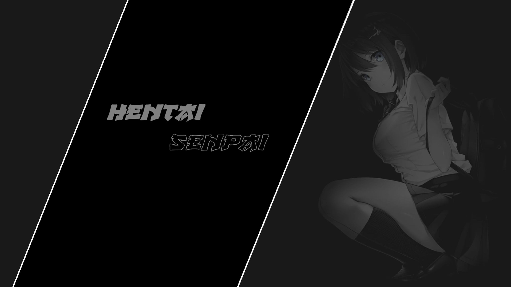

<div align="right" style="margin-bottom: 10px;">
  <details>
    <summary style="background: #2E3440; color: #D8DEE9; border: 1px solid #4C566A; border-radius: 6px; padding: 6px 12px; cursor: pointer; font-size: 13px; display: inline-flex; align-items: center; gap: 6px; font-family: -apple-system, BlinkMacSystemFont, 'Segoe UI', Helvetica, Arial, sans-serif; list-style: none;">🌐 Langue</summary>
    <div style="margin-top: 8px; padding: 10px; background: #3B4252; border: 1px solid #4C566A; border-radius: 6px; text-align: right;">
      <div style="margin-bottom: 4px;"><a href="../../README.md" style="color: #88C0D0; text-decoration: none;">🇺🇸 English</a></div>
      <div style="margin-bottom: 4px;"><a href="../pt-br/README.md" style="color: #88C0D0; text-decoration: none;">🇧🇷 Português</a></div>
      <div style="margin-bottom: 4px;"><a href="../es-es/README.md" style="color: #88C0D0; text-decoration: none;">🇪🇸 Español</a></div>
      <div style="margin-bottom: 4px;"><a href="../fr-fr/README.md" style="color: #88C0D0; text-decoration: none;"><strong>🇫🇷 Français</strong></a></div>
      <div style="margin-bottom: 4px;"><a href="../de-de/README.md" style="color: #88C0D0; text-decoration: none;">🇩🇪 Deutsch</a></div>
      <div style="margin-bottom: 4px;"><a href="../it-it/README.md" style="color: #88C0D0; text-decoration: none;">🇮🇹 Italiano</a></div>
      <div style="margin-bottom: 4px;"><a href="../ja-jp/README.md" style="color: #88C0D0; text-decoration: none;">🇯🇵 日本語</a></div>
      <div style="margin-bottom: 4px;"><a href="../zh-cn/README.md" style="color: #88C0D0; text-decoration: none;">🇨🇳 中文</a></div>
      <div><a href="../ru-ru/README.md" style="color: #88C0D0; text-decoration: none;">🇷🇺 Русский</a></div>
    </div>
  </details>
</div>

# Thème Hentai-Senpai

<p align="center">
  <a href="https://github.com/PhantomNimbi/Hentai-Senpai-GTK-Theme/releases"></a>
  <a href="https://github.com/PhantomNimbi/Hentai-Senpai-GTK-Theme/blob/main/src/COPYING"></a>
  <a href="https://github.com/PhantomNimbi/Hentai-Senpai-GTK-Theme/stargazers"></a>
  <a href="https://github.com/PhantomNimbi/Hentai-Senpai-GTK-Theme/issues"></a>
  <a href="https://gtk.org"></a>
</p>

Un magnifique thème GTK sombre basé sur [Orchis](https://github.com/vinceliuice/Orchis-theme) avec l'élégante palette de couleurs [Nord](https://www.nordtheme.com/).



<h2 align="center">🐧 Distributions Prises en Charge</h2>

<p align="center">
  <a href="https://ubuntu.com"></a>&nbsp;&nbsp;
  <a href="https://www.debian.org"></a>&nbsp;&nbsp;
  <a href="https://getfedora.org"></a>&nbsp;&nbsp;
  <a href="https://archlinux.org"></a>&nbsp;&nbsp;
  <a href="https://manjaro.org"></a>&nbsp;&nbsp;
  <a href="https://www.opensuse.org"></a>&nbsp;&nbsp;
  <a href="https://linuxmint.com"></a>&nbsp;&nbsp;
  <a href="https://pop.system76.com"></a>
</p>

## Fonctionnalités

- **Sombre et Élégant** — Arrière-plans bleu-gris profonds avec un contraste confortable
- **Couleurs Nord** — Schéma de couleurs inspiré de l'Arctique conçu pour la clarté
- **Design Material** — Coins arrondis, ombres douces, effets d'ondulation
- **Support Multi-DE** — GNOME, Cinnamon, XFCE, Budgie et MATE
- **Thématisation Complète** — GTK 2/3/4, GNOME Shell, décorations de fenêtres, fonds d'écran
- **GTK4 Moderne** — Support complet pour les applications basées sur libadwaita
- **Prêt pour Flatpak** — Support de thème pour les applications en bac à sable

## Démarrage Rapide

```bash
# Installer avec tous les correctifs recommandés
./install.sh --update -l -f --dock

# Appliquer le thème
./scripts/apply.sh
```

## Prérequis

- GTK 3.20+ ou GTK 4.0+
- GNOME Shell 40+ (pour les utilisateurs GNOME)
- Bash 4.0+

## Installation

```bash
# Installation de base
./install.sh

# Installation complète (recommandée) — inclut GTK4, Flatpak et les correctifs de dock
./install.sh --update -l -f --dock
```

### Options d'Installation

| Option | Court | Description |
|--------|-------|-------------|
| `--update` | | Mettre à jour/réinstaller le thème |
| `--uninstall` | `-u` | Supprimer le thème |
| `--libadwaita` | `-l` | Corriger les applications GTK4/libadwaita |
| `--flatpak` | `-f` | Corriger les applications Flatpak |
| `--dock [TYPE]` | | Thème du dock (transparent\|solid) |
| `--wallpapers` | `-w` | Installer les fonds d'écran |

## Documentation

📚 **[Wiki de Documentation Complète](https://github.com/PhantomNimbi/Hentai-Senpai-GTK-Theme/wiki)** — Guides complets et dépannage

- **[Guide d'Installation](https://github.com/PhantomNimbi/Hentai-Senpai-GTK-Theme/wiki/Installation-Guide)** — Instructions de configuration détaillées
- **[Dépannage](https://github.com/PhantomNimbi/Hentai-Senpai-GTK-Theme/wiki/Troubleshooting)** — Problèmes courants et solutions
- **[Palette de Couleurs](https://github.com/PhantomNimbi/Hentai-Senpai-GTK-Theme/wiki/Color-Palette)** — Référence des couleurs Nord
- **[Personnalisation](https://github.com/PhantomNimbi/Hentai-Senpai-GTK-Theme/wiki/Customization)** — Personnaliser le thème
- **[Contribuer](https://github.com/PhantomNimbi/Hentai-Senpai-GTK-Theme/wiki/Contributing)** — Comment contribuer

## Corrections Rapides

**Applications GTK4 non thémées ?** `./install.sh -l` puis déconnexion/reconnexion

**Applications Flatpak non thémées ?** `./install.sh -f` puis redémarrage des applications Flatpak

**Dock non stylisé ?** `./install.sh --dock transparent` ou `--dock solid`

## Contribuer

Les contributions sont les bienvenues ! Consultez le [Guide de Contribution](https://github.com/PhantomNimbi/Hentai-Senpai-GTK-Theme/wiki/Contributing) pour les directives.

- 🐛 [Signaler des bugs](https://github.com/PhantomNimbi/Hentai-Senpai-GTK-Theme/issues)
- ✨ [Suggérer des fonctionnalités](https://github.com/PhantomNimbi/Hentai-Senpai-GTK-Theme/discussions)
- 📝 Améliorer la documentation

## Crédits

- Basé sur [Orchis Theme](https://github.com/vinceliuice/Orchis-theme) par vinceliuice
- Palette de couleurs [Nord Theme](https://www.nordtheme.com/) par Arctic Ice Studio

## Licence

Licence GPL-3.0 — consultez le fichier [COPYING](../../src/COPYING) pour plus de détails.

---

**Profitez de votre nouveau thème !** 🎨

Pour obtenir de l'aide, consultez le [wiki de documentation](https://github.com/PhantomNimbi/Hentai-Senpai-GTK-Theme/wiki).
